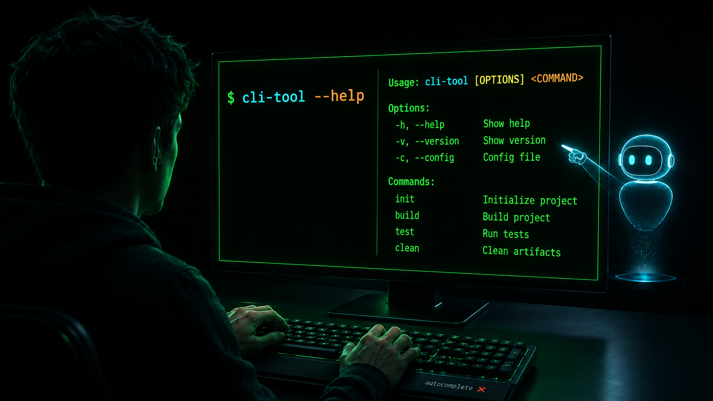

> 🌐 **中文版**: [README.md](./README.md)

[](https://opensource.org/licenses/MIT)
[](https://docs.claude.com/en/docs/claude-code/overview)
[](https://www.skills.sh/)
[](https://github.com/huasanai/handcode-tutor/tags)

<p align="center">
  
</p>

# handcode-tutor

> **An AI coach that walks you through typing commands by hand. Autocomplete off. Type it, break it, own it — the AI just stands next to you and explains why.**

An [Agent Skill](https://www.skills.sh/) built for learners. It codifies *verify-first → step-by-step coaching → collaborative howto distillation* into the AI's workflow.

---

## Why I built this

I'm learning to code, and I'm making a counter-cultural choice: **autocomplete off — I type every character myself.**

<p align="center">
  
</p>

Here's what I noticed: when the AI one-shots a command for me, the output is correct but my head is empty. **Speed lets me skip the "digestion" step.**

So I flipped it. The AI is my teacher, explaining every flag and intent — but the muscle memory in my fingers has to be mine. I'll mistype, forget flags, mess up argument order. **Those mistakes are exactly where I learn.**

`handcode-tutor` codifies this "spar with me, don't replace me" workflow. If you also want the AI to be your teacher — not your stand-in — this skill is for you.

---

## What problem it solves

You want to type the commands yourself when learning a new tool (upgrading a CLI, configuring git, installing a Python package…). You don't want the AI to one-shot it for you, and you don't want to be misled by a plausible-sounding-but-wrong answer.

But casual chat with an AI runs into three traps:

- **The AI hallucinates commands** — quotes a subcommand or flag that doesn't exist, based on stale training-time knowledge.
- **The AI does it for you** — you wanted to type and feel it out, but the agent just executed the whole flow.
- **You learn it once, then forget** — solved live, gone tomorrow, starts from scratch next time.

`handcode-tutor` seals these three holes with five iron rules.

---

## Five core values

### 1. Coach mode, from the learner's POV

Rule 3: **the user types, the assistant explains**. Unless you explicitly say "you run it," the AI only hands you one command at a time — with each flag explained and the expected output described. You type it in your own terminal, paste back the result, and the AI interprets. Pair with **IDE autocomplete turned off** to build code muscle memory.

### 2. The "verify-first" hard rule

Rule 1: **no assertions from training-time knowledge**. Before stating any specific command / URL / version number, the assistant must first:

- `<tool> --help` for official usage
- `npm view <pkg>` for real metadata
- `curl -sI <url>` to verify a URL exists
- read the actual lock file / config / source

If it can't find the answer, it says "let me look that up first" — instead of confidently making up a plausible-looking command.

### 3. Read errors literally

| Error pattern | 99% cause |
|---|---|
| `not found matching X` | typo, casing, missing scope prefix |
| `Permission denied` | path perms / missing sudo |
| `command not found` | PATH not set / not installed |
| `Module not found` | dependency missing / wrong path |

Honest error messages are the cheapest gift a tool author can give you.

### 4. Four-step concept explanation

Rule 4: when a new concept first appears —
1. one-line **definition**
2. one-line **why it matters**
3. an **example** under 3 lines
4. **bilingual terminology**: `English (中文)` for non-native readers

Don't lead with history. Don't lead with internals. Don't dump background.

### 5. Distill into reusable howtos

After every hands-on session, the AI co-writes the whole experience into a `type: howto` Markdown: question list + key concepts + full flow + gotchas + further reading. Starts as `status: draft`, and **stays draft until the user explicitly says "looks good"** — preventing wishful-thinking "done."

---

## Install

```bash
# Install globally via the skills CLI
npx skills add huasanai/handcode-tutor -g -y
```

After install, you'll find `handcode-tutor/` in your agent's skills directory (Claude Code default: `~/.claude/skills/`).

Supported agents: see [skills.sh](https://www.skills.sh/) (Claude Code / Codex CLI / Cursor / Gemini CLI and a dozen others).

---

## How to invoke

In Claude Code (or any compatible agent), just speak naturally:

- "I want to **hand-type my way** through upgrading lark-cli"
- "Walk me through configuring git SSH, then turn it into a howto"
- "Teach me ffmpeg hand-by-hand — I'll type the commands myself"
- "**Autocomplete off**, teach me jq for muscle memory"
- "Learn and distill — explain the difference between npm and npx"

The skill auto-runs its three phases: *verify facts → step-by-step coaching → collaborative distillation*.

---

## Project structure

```
handcode-tutor/
├── README.md
├── README.en.md
├── LICENSE
├── .gitignore
└── skills/
    └── handcode-tutor/
        ├── SKILL.md                       # five iron rules + three phases
        └── references/
            └── howto-template.md          # howto skeleton
```

---

## Design principles

- **Not a substitute, a sparring partner.** The AI doesn't type for the user; it points the way and lets the user run.
- **Verify first.** Specific commands / flags / URLs must be verified live, never asserted from memory.
- **Small steps that actually run.** One command at a time + flag explanation + expected output + react to user feedback.
- **Errors are conversation.** Read error messages as the author's honest reply — don't route around them.
- **Distillation is collaborative.** Docs have two states (`draft` / `stable`); always `draft` until the user confirms.

---

## Support & Connect

### Reach me

| Platform | Handle |
|---|---|
| 💬 WeChat | `huasanai` |
| 🐦 X | [@yfusionai](https://x.com/yfusionai) |
| 🎬 Douyin | [@画伞](https://v.douyin.com/zHu4VUhztes/) |

---

## License

MIT © 画伞 (huasan)
